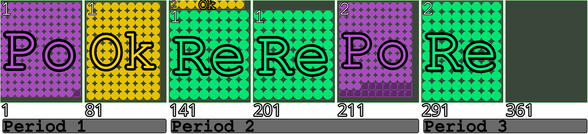

# Planning small scale agriculture to optimize nutritional intake for households living on small daily budgets
The Mixed-integer Linear Programming Model (with all configuration files), that was used to generate results for my master thesis.

## Install
This program uses pipenv to ensure reproducibility. You will need to have [pipenv](https://github.com/pypa/pipenv) installed. 

- Clone the project
- `pipenv sync` (This installs all packages specified in Pipfile.lock in a virtual environment)

## Optional install
Linear programming models are generated by python-mip which uses the CBC solver by default. Using Gurobi requires a local installation. After installing gurobi set the following envrionment variables so that gurobi can be found:

```bash
# Gurobi environment variables
export GUROBI_HOME="/opt/gurobi1002/linux64/"
export PATH="${PATH}:${GUROBI_HOME}/bin"
export LD_LIBRARY_PATH="${LD_LIBRARY_PATH}:${GUROBI_HOME}/lib"
```
You will of course also need a gurobi license.

# Running the code
Now you can run `pipenv shell` to enter the virtual environment and execute the code with `cli`.
To excecute the solver on the default problem specified by the config files: `cli run` 

